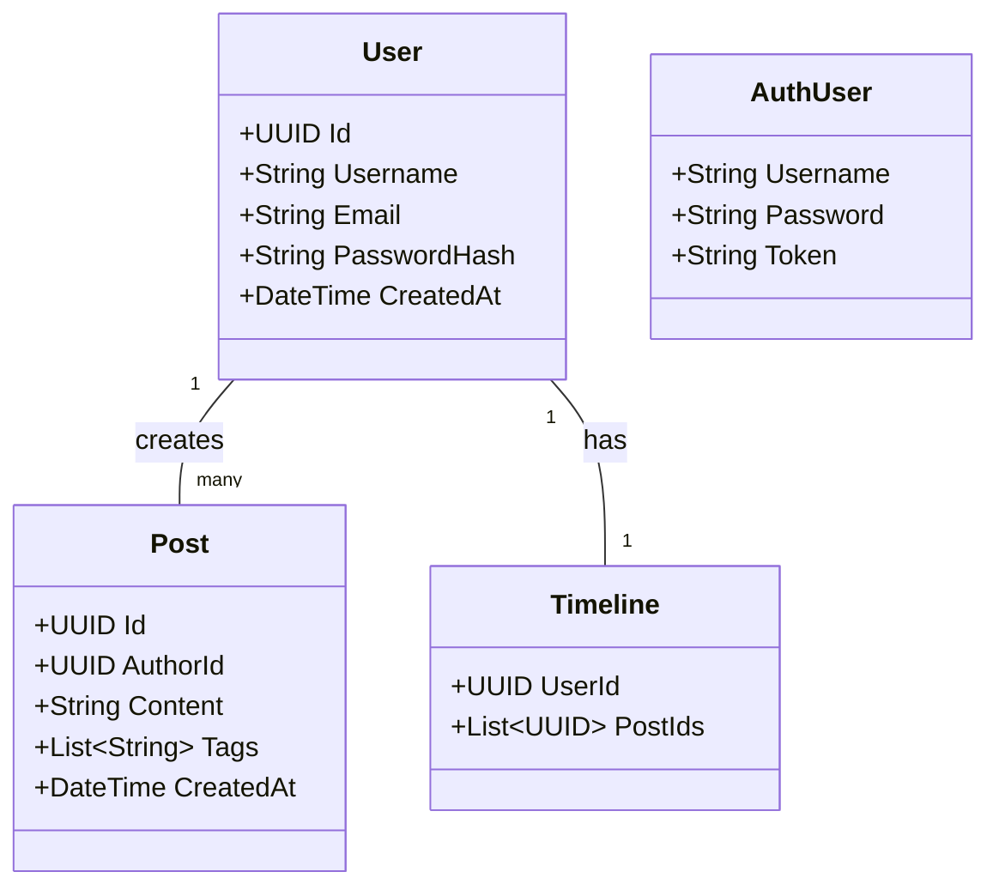
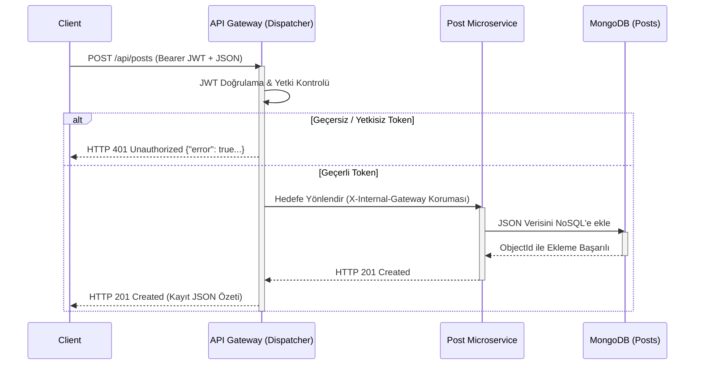
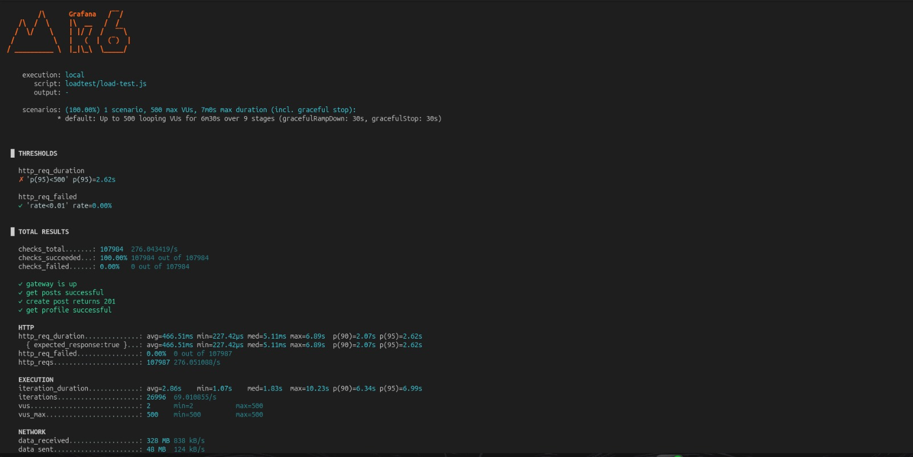
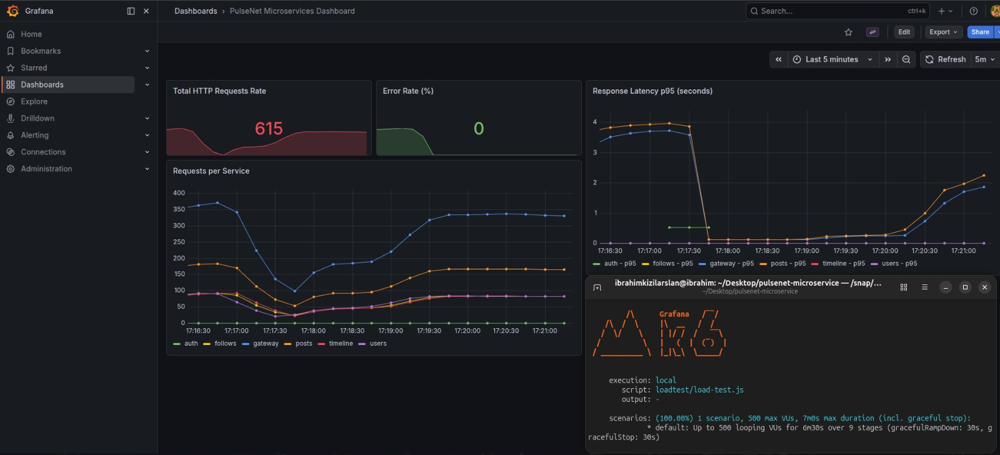
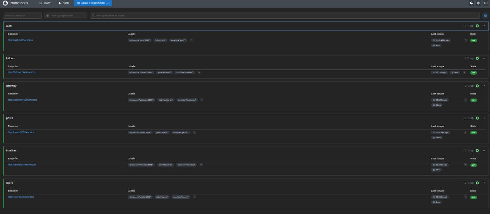

# Proje Raporu: PulseNet - Microservices Social Media Platform

## 1. Proje Bilgileri
- **Proje Adı:** PulseNet - Microservices Social Media Platform
- **Ekip Üyeleri:** İbrahim KIZILARSLAN 231307045, Cihat KARATAŞ 231307078
- **Tarih:** 5 Nisan 2026
- **Akademisyen:** Dr. Öğr. Üyesi Samet DİRİ


## 2. Giriş (Problem Tanımı ve Amaç)
Modern web uygulamalarının sürekli artan trafikleri, genişleyen özellikleri ve bakım ihtiyaçları geleneksel monolitik mimarilerin sınırlarını zorlamaktadır. Uygulama büyüdükçe kod tabanının karmaşıklaşması, bir modüldeki hatanın tüm sistemi çökertme riski, teknolojiyi tek bir platforma hapsetme ve ölçekleme zorlukları bu problemlerin başlıcalarıdır. 

**Projenin Amacı:** PulseNet projesi, bu monolitik mimari sorunlarını aşmak üzere mikroservis mimarisine ve API Gateway (Dispatcher) desenine dayalı bir sosyal medya platformu simülasyonu geliştirmeyi amaçlamaktadır. Sistem, tüm dış istekleri tek bir merkezden (Gateway) karşılayarak yönlendiren, arka planda birbirinden izole, bağımsız NoSQL veritabanlarına sahip mikroservislerin (Auth, Users, Posts, Follows, Timeline) TDD (Test-Driven Development) prensipleriyle sorunsuz bir şekilde orkestre edilmesini hedeflemektedir. Öğrenciler proje kapsamında nesne yönelimli programlama, ağ yönetimi, gelişmiş REST standartları ve güncel sistem tasarım becerilerini tatbik etmiştir.

## 3. Mimari Tasarım, Modeller ve Teori

### 3.1. Mikroservis Mimarisi ve API Gateway
Mikroservis mimarisi, büyük bir uygulamanın küçük, bağımsız ve birlikte çalışabilen servislere bölünmesi yaklaşımıdır. Bu projede dış dünyadan gelen (Client) tüm istekler doğrudan mikroservislere değil, **API Gateway (Dispatcher)** üzerine gelir. API Gateway istekleri alır, yetkilendirmeyi (JWT) doğrular ve servisler arası ağ izolasyonu ("Network Isolation") sağlayarak ilgili mikroservise iletir. Sistem böylece yetkilendirme mantığını her servise tek tek gömmek yerine tek noktada çözümler.

### 3.2. RESTful Servisler ve Richardson Olgunluk Modeli (RMM)
REST (Representational State Transfer), web standartlarını kullanarak istemci-sunucu arasındaki veri alışverişini tanımlayan mimari bir yaklaşımdır. **Richardson Olgunluk Modeli (RMM)**, web hizmetlerinin REST standartlarına ne kadar uyduğunu belirleyen bir derecelendirme modelidir.

Projemizdeki tüm uç noktalar (endpoints) **RMM Seviye 2** standartlarına sıkı sıkıya bağlıdır. Kaynaklar (Resource) URI üzerinden tanımlanır (örneğin; `.../api/deleteUser?id=1` gibi parametrik yaklaşımlar yerine `.../api/users/{id}` şeklinde kaynak yolları kullanılır).
- HTTP Metotları tam anlamıyla (GET = Okuma, POST = Ekleme, PUT = Güncelleme, DELETE = Silme) amaca yönelik kullanılır.
- İşlem sonucunu tam olarak ifade eden HTTP durum kodları (200 OK, 201 Created, 401 Unauthorized, 404 Not Found, 400 Bad Request vb.) döndürülür.
- Hatalar yakalanır ve JSON gövdesinde `{"error": true, ...}` gibi tutarlı değerler içeren standart hata mesajları döner.

### 3.3. Sınıf (Veri) ve Nesne Diyagramları
Proje kapsamında her servis kendi alanıyla (domain) ilgilenmektedir. Object-Oriented Programming (OOP) ve SOLID kuralları titizlikle uygulanmıştır. Sistemin temel veri yapılarını barındıran bazı modellerin basitleştirilmiş sınıf diyagramı:



### 3.4. İstek ve Akış Çalışma Mantığı (Sequence Diagram)
Dışarıdan bir istemcinin platformda yeni bir gönderi (post) oluşturduğu temel senaryoyu içeren Sequence Diagram (Sıra Diyagramı):



### 3.5. Karmaşıklık Analizi ve Literatür Çıkartımı
- **Zaman Karmaşıklığı (Time Complexity):** API Gateway yönlendirme maliyeti yükseklik bakımından O(1)'dir; çünkü rotalar uygulama ilk kalkarken tanımlı olan tablo üzerinden eşleşir. Veri tabanı işlemleri MongoDB sayesinde (id veya belirli alan indekslemesi kullanılarak) ortalama `O(1)` veya `O(log N)` hızında çalışır.
- **Alan Karmaşıklığı (Space Complexity):** İstemci katmanından Gateway'e ve servisler arasına aktarılan veri (payload) JSON metinlerinden oluştuğu için maliyeti önemsizdir. Veri tabanı bazında her servisin kendi izole veri yapısı `O(N)` maliyetle ölçeklenir, log kayıtları ise sınırlı ve denetimlidir.
- **Literatür (Literature):** Günümüz teknoloji devi şirketleri (Netflix, Amazon vs.) artan "Tightly-Coupled" (Sıkı Sıkıya Bağlı) monolitik hizmetlerini mikroservislerle değiştirerek "Loosely-Coupled" (Gevşek Bağlı) mimarilerle yönetmektedir. Özellikle veri tabanı izolasyonu ("Database-per-service" deseni) ve tek erişim noktalı Gateway tasarımları mikroservisin başlıca önkoşulu olarak gösterilir.

## 4. Proje Modüllerinin ve İşlevlerin Açıklanması

Genel sistem ağ mimarisini gösteren akış (Flow) diyagramı:

```mermaid
graph TD
    Client[İstemci / Web UI / K6] -->|HTTP:8080| Gateway[Dispatcher / API Gateway]
    
    subgraph Korumalı İç Ağ (Network Isolation)
        Gateway -.->|internal_net / proxy| Auth[Auth Service]
        Gateway -.->|internal_net / proxy| Users[User Service]
        Gateway -.->|internal_net / proxy| Posts[Post Service]
        Gateway -.->|internal_net / proxy| Follows[Follows Service]
        Gateway -.->|internal_net / proxy| Timeline[Timeline Service]
        
        Auth --> DB_Auth[(NoSQL - Auth DB)]
        Users --> DB_Users[(NoSQL - Users DB)]
        Posts --> DB_Posts[(NoSQL - Posts DB)]
        Follows --> DB_Follows[(NoSQL - Follows DB)]
        Timeline --> DB_Timeline[(NoSQL - Timeline DB)]
    end

    style Gateway fill:#f96,stroke:#333,stroke-width:2px,color:#fff
    style Auth fill:#cce5ff,stroke:#666
    style Users fill:#cce5ff,stroke:#666
    style Posts fill:#cce5ff,stroke:#666
    style Follows fill:#cce5ff,stroke:#666
    style Timeline fill:#cce5ff,stroke:#666
```

**Modüller ve Görevleri:**
- **Dispatcher (API Gateway):** Sistemin tek giriş noktasıdır. Tüm metrik, loglama, güvenlik (Network Isolation) kurallarını işletir ve RMM seviyesi isteklerini filtreleyerek, doğru mikroservise URL bazlı bir proxy görevi yapar.
- **Auth Service:** Kullanıcı kayıt (Register) ve oturum açma (Login) süreçlerini kontrol edip JSON Web Token (JWT) oluşturur.
- **User Service:** Kullanıcı profili işlemleri, temel bilgilerin getirilip-güncellenmesi.
- **Post Service:** Gönderilerin saklandığı, detaylandığı ve servis edildiği birim. Tüm modüller kendi veritabanını okur-yazar.
- **Follow & Timeline Servisleri:** Takip döngüsü ve feed oluşturma tarafını temsil eder.

Bu mimari `docker-compose.yml` kullanılarak Dockerize edilmiş olup tek bir `docker-compose up` komutuyla (Gateway, tüm servisler, ilgili NoSQL veritabanları, Prometheus, Grafana) sistem orkestrasyonu sağlanabilmektedir.

## 5. Uygulamaya Ait Açıklamalar, Testler ve Ekran Görüntüleri

### 5.1. Özellikler ve Ekran Görüntüleri Karşılıkları

**Mikroservis İzolasyonu (Network Isolation) ve Güvenlik**
Servisler tek başına dış dünyanın doğrudan erişimine tamamen kapalıdır. Yetkilendirme işlemleri sadece Gateway tarafında çözümlenir, servisler kendilerine doğrudan istek geldiğinde (`X-Internal-Gateway` kuralı) engeller ("Network Isolation" kuralı).


**Veri İzolasyonu (Database-per-service - NoSQL)**
Tüm projede veriler JSON tabanlı NoSQL mimarisi (MongoDB) ile kurgulanmıştır. Her servisin sadece kendi veritabanına ulaştığı test edilmiştir:
.jpeg)

**Richardson Olgunluk Modeli (RMM Seviye 2 - RESTful)**
API uç noktalarının kaynak odaklı olduğu ve doğru HTTP durum kodları döndürdüğü işlemler (Postman veya Thunder Client vb. ile):
- **Oluşturma (POST):** Yeni kaynak oluşturulduğunda `201 Created` dönüşü.
  
- **Tüm Kayıtları Listeleme (GET):** Listeleme başarısı `200 OK`.
  
- **Kayıt Güncelleme (PUT):** Kaynakların başarılı güncelleimi, `200` veya ilişkili kod dönüşü.
  
- **Kayıt Silme (DELETE):** Tam silme ve URL yapısı parametresiz temiz (Örn: `.../post/1` formatı), dönüşte uygun içerik eksikliği bilgisinin iletilmesi.
  
- **Hata Yönetimi ve Durum Kodları:** Tüm hata senaryolarında (örneğin kaydın bulunamaması veya izinsizlik durumlarında) HTTP kodlarına sadık kalınarak, özel JSON (`{"error": true, ...}`) mesajlarının döndüğü sistem:
  

**TDD (Test-Driven Development) ve Birim Testler**
Geliştirme süreci en kritik birim olan Dispatcher için Red-Green-Refactor döngüsüyle yazılmış olan `xUnit` test senaryoları çerçevesinde yapılmıştır:


### 5.2. Performans, İzleme ve Yük Testi Senaryoları
Geliştirilen Dispatcher altyapısının gerçek yük altındaki başarısı ölçülmüştür. Grafiksel arayüz (UI) olarak **Grafana** tercih edilmiş olup detaylı loglar barındırılmaktadır.

- **K6 Yük Testi (Performans):** JMeter/Locust/K6 profesyonel test aracıyla eşzamanlı kullanıcılara hizmet simüle edilmiş; 50, 100, 200 ve 500 istek eşzamanlı atılmıştır. Sistem yönlendirme doğruluğu, HTTP hataları ve süresi raporlanmıştır.

- **Grafana ve Prometheus:** Tüm trafik süreçlerinin API bazında anlık olarak görselleştirilmesi, başarı orantılaması ve yük oranlarının arayüz izlenmesi.



## 6. Sonuç, Başarılar, Sınırlılıklar ve Olası Geliştirmeler 

**Başarılar:**
- Monolitik sistemlerin yarattığı çökme, darboğaz ve kod düzensizliği tamamen ortadan kaldırılarak izole, ölçeklenebilir ve temiz bir OOP mimarisi oluşturulmuştur.
- Gateway servisinde TDD kurallarına tam riayet edilerek sürdürülebilir bir sistem ve minimum hata payı güvence altına alınmıştır.
- İstek yönlendirmesi URL yapısına göre tasarlanmış ve güvenli bir ağ yalıtımı (Network Isolation) yapılarak mikroservisleri dış saldırılardan kurtarılmıştır.
- Her servisin veri izolasyonu, kendi MongoDB havuzunda tutularak kusursuz bir veri modeli yaratılmıştır. RMM Seviye 2'nin uçtan uca uygulanması projenin kalitesini yükseltmiştir.
- Profesyonel k6 stres testleri başarıyla aşılarak Gateway mimarisinin dayanaklılığı kanıtlanmaktadır.

**Sınırlılıklar:**
- Servislerin birbiri ile konuşmalarının anlık (senkron request/response - HTTP) olarak tasarlanması, yüksek hacimli (Örn: birden çok veritabanı okuyup cevap dönmesi) bazı kompleks analizlerde sistemde bekleme anına neden olabilir.
- Eklenen her yeni mikroservis için veritabanı yalıtımı uygulamak veritabanı maliyetini ve bakımını idari olarak zorlaştırmaktadır.

**Olası Geliştirmeler:**
- Uygulamaya asenkron bir mekanizma olan Message Brokers (RabbitMQ / Apache Kafka) ilave edilebilir. Böylece, kullanıcıların attıkları yeni "Post"lar anında bir Timeline yayıcısına event tabanlı (Event-Driven) işlenerek, beklemeler sonlandırılır.
- Grafana ile izlenen logların ELK (Elasticsearch, Logstash, Kibana) yığınına taşınarak log tabanlı daha karmaşık analizler ve anomali tespiti elde edilebilir.
- Dağıtık bir önbellek (Distributed Cache - Redis) kurularak, sistem sürekli tekrar eden "Timeline" listesi taleplerinin veri tabanına inmesini engelleyerek daha yüksek performansta beslemesini sağlayabilir.

**Genel Değerlendirme:**
Özetle; PulseNet raporlanan tüm teknik ve işlevsel gereksinimlerin karşılanmasını sağlamış, performanslı, endüstri standartlarına (OOP, RMM Level 2, Dockerize yapı, TDD vs.) uyumlu uçtan uca örnek teşkil edecek bir bulut mimari çözümünü başarıyla implemente etmiştir.
