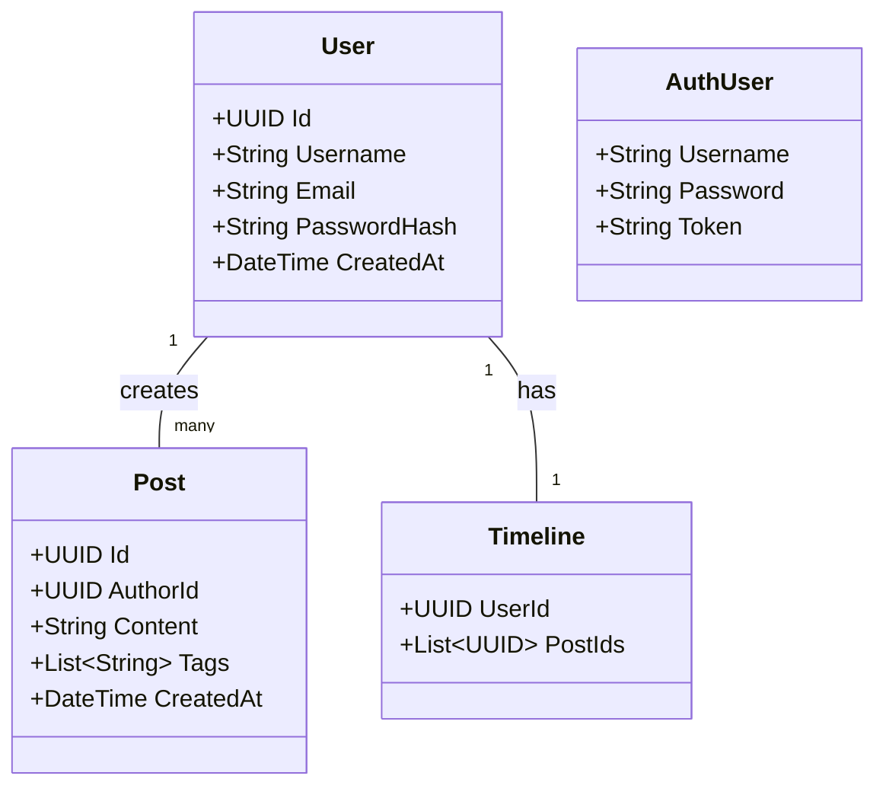
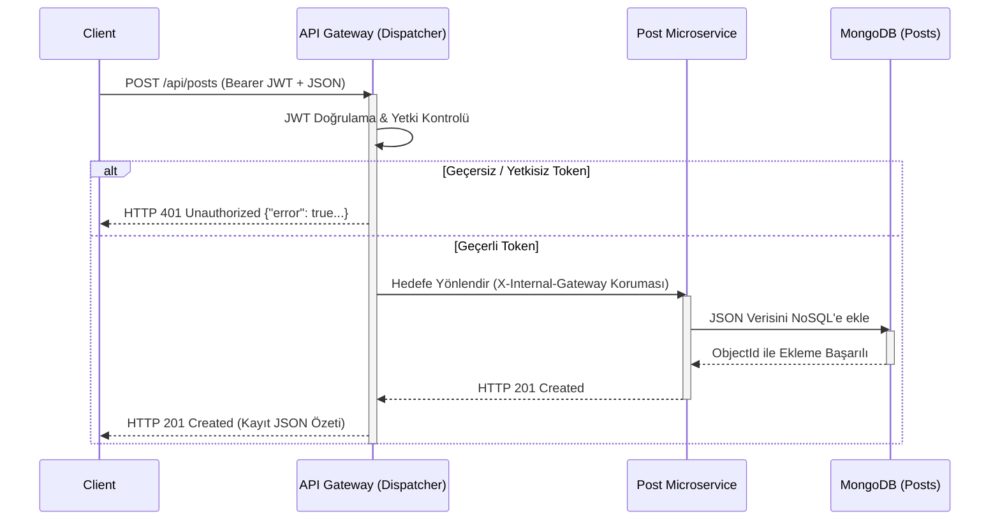

# Proje Raporu: PulseNet - Microservices Social Media Platform

## 1. Proje Bilgileri
- **Proje Adı:** PulseNet - Microservices Social Media Platform
- **Ekip Üyeleri ve Grup Numarası:** İbrahim KIZILARSLAN 231307045, Cihat KARATAŞ 231307078 , Grup 32
- **Tarih:** 5 Nisan 2026
- **Akademisyen:** Dr. Öğr. Üyesi Samet DİRİ

## 2. Giriş (Problem Tanımı ve Amaç)
Modern web uygulamalarının sürekli artan trafikleri, genişleyen özellikleri ve bakım ihtiyaçları geleneksel monolitik mimarilerin sınırlarını zorlamaktadır. Uygulama büyüdükçe kod tabanının karmaşıklaşması, bir modüldeki hatanın tüm sistemi çökertme riski, teknolojiyi tek bir platforma hapsetme ve ölçekleme zorlukları bu problemlerin başlıcalarıdır. 

**Projenin Amacı:** PulseNet projesi, bu monolitik mimari sorunlarını aşmak üzere mikroservis mimarisine ve API Gateway (Dispatcher) desenine dayalı bir sosyal medya platformu simülasyonu geliştirmeyi amaçlamaktadır. Sistem, tüm dış istekleri tek bir merkezden (Gateway) karşılayarak yönlendiren, arka planda birbirinden izole, bağımsız NoSQL veritabanlarına sahip mikroservislerin (Auth, Users, Posts, Follows, Timeline) TDD (Test-Driven Development) prensipleriyle sorunsuz bir şekilde orkestre edilmesini hedeflemektedir. Öğrenciler proje kapsamında nesne yönelimli programlama, ağ yönetimi, gelişmiş REST standartları ve güncel sistem tasarım becerilerini tatbik etmiştir.

## 3. Mimari Tasarım, Modeller ve Teori

### 3.1. Mikroservis Mimarisi ve API Gateway
Mikroservis mimarisi, büyük bir uygulamanın küçük, bağımsız ve birlikte çalışabilen servislere bölünmesi yaklaşımıdır. Bu projede dış dünyadan gelen (Client) tüm istekler doğrudan mikroservislere değil, **API Gateway (Dispatcher)** üzerine gelir. API Gateway istekleri alır, yetkilendirmeyi (JWT) doğrular ve servisler arası ağ izolasyonu ("Network Isolation") sağlayarak ilgili mikroservise iletir. Sistem böylece yetkilendirme mantığını her servise tek tek gömmek yerine tek noktada çözümler.

### 3.2. RESTful Servisler ve Richardson Olgunluk Modeli (RMM)
REST (Representational State Transfer), web standartlarını kullanarak istemci-sunucu arasındaki veri alışverişini tanımlayan mimari bir yaklaşımdır. **Richardson Olgunluk Modeli (RMM)**, web hizmetlerinin REST standartlarına ne kadar uyduğunu belirleyen bir derecelendirme modelidir.

Projemizdeki tüm uç noktalar (endpoints) **RMM Seviye 2** standartlarına sıkı sıkıya bağlıdır. Kaynaklar (Resource) URI üzerinden tanımlanır (örneğin; `.../api/deleteUser?id=1` gibi parametrik yaklaşımlar yerine `.../api/users/{id}` şeklinde kaynak yolları kullanılır).
- HTTP Metotları tam anlamıyla (GET = Okuma, POST = Ekleme, PUT = Güncelleme, DELETE = Silme) amaca yönelik kullanılır.
- İşlem sonucunu tam olarak ifade eden HTTP durum kodları (200 OK, 201 Created, 401 Unauthorized, 404 Not Found, 400 Bad Request vb.) döndürülür.
- Hatalar yakalanır ve JSON gövdesinde `{"error": true, ...}` gibi tutarlı değerler içeren standart hata mesajları döner.

### 3.3. Sınıf (Veri) ve Nesne Diyagramları
Proje kapsamında her servis kendi alanıyla (domain) ilgilenmektedir. Object-Oriented Programming (OOP) ve SOLID kuralları titizlikle uygulanmıştır. Sistemin temel veri yapılarını barındıran bazı modellerin basitleştirilmiş sınıf diyagramı:

### 3.4. İstek ve Akış Çalışma Mantığı (Sequence Diagram)
Dışarıdan bir istemcinin platformda yeni bir gönderi (post) oluşturduğu temel senaryoyu içeren Sequence Diagram (Sıra Diyagramı):

