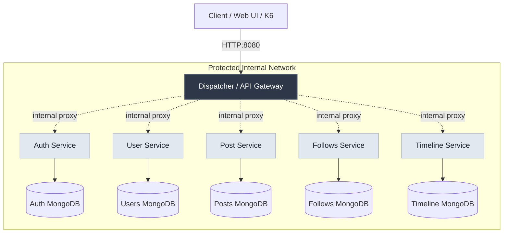

# PulseNet: Microservices Social Media Platform

PulseNet is a comprehensive, scalable social media backend simulation built entirely on a Microservices architecture using .NET, MongoDB, and Docker. 

Designed to demonstrate advanced system design and overcome the limitations of monolithic web applications, this project implements strict network isolation, database-per-service patterns, API Gateway routing, Test-Driven Development (TDD), and a complete observability stack.

---

## 🏗 System Architecture

PulseNet utilizes a centralized **API Gateway (Dispatcher)** to handle all incoming client traffic. The frontend and external users interact solely with the gateway. Internal services are completely hidden behind a protected Docker network.



---

## 🧩 Microservices Breakdown

The platform is strictly decoupled into independent services using the **Database-per-Service** design. Each service only communicates with its own MongoDB instance.

| Service | Route / Internal Port | Description | Database Port (Local) |
| :--- | :--- | :--- | :--- |
| **API Gateway** | `http://localhost:8080/` | Central entry point. Validates JWT, limits rate, routes traffic via reverse proxy. | `27017` |
| **Auth Service** | `/api/auth` | Handles User Registration, Login, and issues JWT tokens (`PulseNet` Issuer/Audience). | `27018` |
| **Users Service** | `/api/users` | Handles user profile CRUD operations. | `27019` |
| **Posts Service** | `/api/posts` | Manages creating and fetching posts. Communicates indirectly with Timeline downstreams. | `27020` |
| **Follows Service** | `/api/follows` | Stores follow graphs (who follows whom). | `27021` |
| **Timeline Service** | `/api/timeline` | Aggregates and returns the customized feed timeline for users. | `27022` |

> **RESTful Standard:** All APIs strictly adhere to **Richardson Maturity Model (RMM) Level 2**, utilizing correct HTTP Resource paths and returning semantic standard response codes (`201 Created`, `401 Unauthorized`, `404 Not Found`, etc.).

---

## 📊 Observability: Grafana & Prometheus

PulseNet features a complete monitoring and observability stack built into its infrastructure to visualize traffic routing, success rates, and API performance. 

- **Prometheus (Port `9090`)**: Actively scrapes metrics from the API Gateway and backend services.
- **Grafana (Port `3000`)**: Readily configured with dashboards visualizing Prometheus data points.
  - **URL:** `http://localhost:3000`
  - **Credentials:** `admin` / `admin`

*Note: The configurations are pre-provisioned in the `./infra/grafana` and `./infra/prometheus` directories.*

---

## ⚡ Performance & Load Testing (K6)

System resilience is validated using [K6](https://k6.io/). The `loadtest/` directory contains professional scripts used to simulate heavy traffic against the API Gateway.

- **`load-test.js`**: Simulates hundreds of continuous concurrent user interactions.
- **`smoke-test.js`**: Runs minimal infrastructure sanity checks.
- **`test-requests.http`**: A collection of sample HTTP requests for manual debugging.

To run a test locally (requires K6 installed):
```bash
cd loadtest
k6 run load-test.js
```

---

## 📂 Project Structure

```text
pulsenet-microservice/
├── src/                      # Source code for the backend
│   ├── Gateway/              # API Gateway (.NET)
│   ├── Services/             # The 5 independent Microservices
│   └── BuildingBlocks/       # Shared libraries, event classes, or common base models
├── infra/                    # Infrastructure and Deployment configurations
│   ├── docker-compose.yml    # Main orchestration mapping 13+ containers
│   ├── prometheus/           # Prometheus scraping configurations
│   └── grafana/              # Grafana dashboards and provisioning
├── tests/                    # xUnit Test projects (Unit & Integration)
└── loadtest/                 # K6 JavaScript performance testing scripts
```

---

## 🚀 Getting Started

### Prerequisites
- [Docker Engine](https://docs.docker.com/get-docker/) & [Docker Compose](https://docs.docker.com/compose/install/)
- .NET 8 SDK (Only if compiling/testing natively outside Docker)

### Running the Infrastructure

1. **Clone the repository:**
   ```bash
   git clone https://github.com/yourusername/pulsenet-microservice.git
   cd pulsenet-microservice/infra
   ```

2. **Boot up Docker Compose:**
   Run the following command within the `infra` directory. This single command orchestrates the Gateway, 5 Microservices, 6 MongoDB instances, Prometheus, and Grafana.
   ```bash
   docker-compose up -d --build
   ```

3. **Verify the installation:**
   Wait a minute for the containers to fully initialize.
   - API Gateway: `http://localhost:8080/`
   - Grafana Dashboard: `http://localhost:3000/` `(admin/admin)`

4. **Shutting down:**
   ```bash
   docker-compose down
   ```

---

## 🛡 Network Isolation & Security
PulseNet utilizes Docker's custom bridged network (`internal_net`) to completely isolate backend modules. 
- You *cannot* reach the Auth, Users, or Timeline services directly from your host machine browser. 
- You MUST pass through the `localhost:8080` API Gateway with valid JSON Web Tokens (JWT) which securely routes requests internally via Reverse Proxy techniques.
