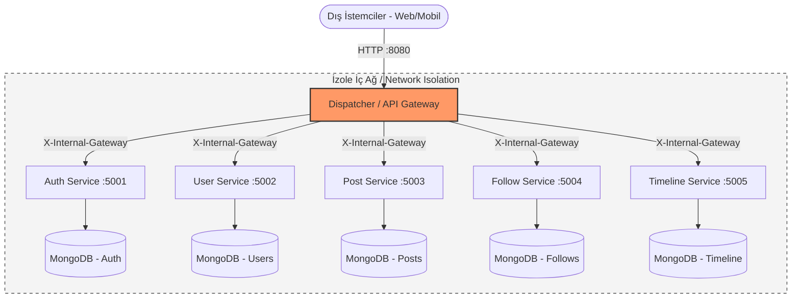
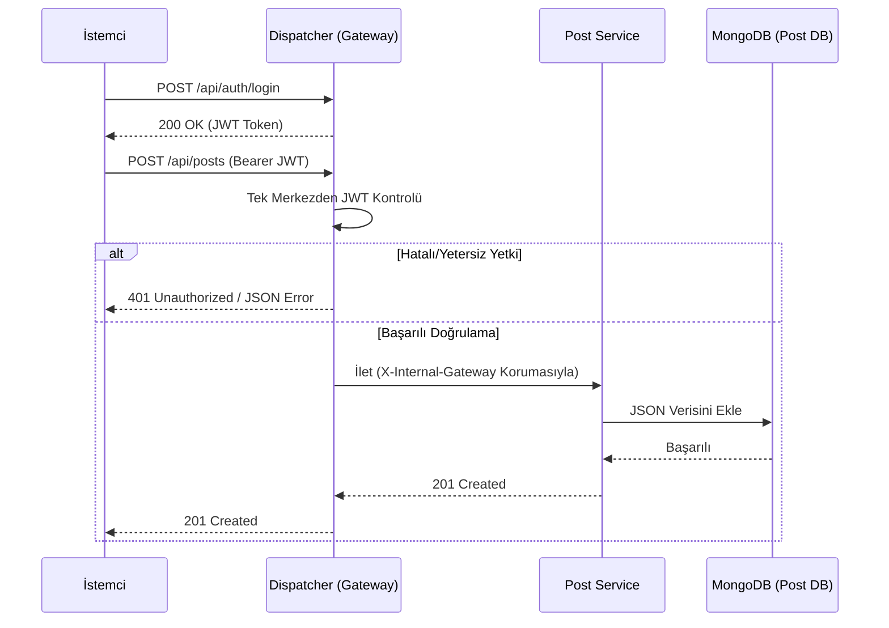

# 🚀 PulseNet — Microservices Social Media Platform


PulseNet, merkezinde uçtan uca yönetilen bir Dispatcher (API Gateway) olan; tamamen bağımsız ve izole mikroservislerin birbiriyle konuştuğu **TDD (Test-Driven Development)** prensipleriyle geliştirilmiş modern bir sosyal medya platformu simülasyonudur. Proje, monolitik yapıların ölçeklenme ve hata yönetimi problemlerini ortadan kaldırmak için tasarlanmıştır.

## 🏗️ Sistem Mimarisi

Dış dünyadan gelen tüm istekler, Network Isolation (Ağ İzolasyonu) kuralları gereği *yalnızca* Dispatcher üzerinden geçer ve ilgili iç mikroservise güvenli bir şekilde aktarılır.



### ✨ Öne Çıkan Özellikler

- **Gelişmiş Dispatcher (API Gateway):** YARP gibi hazır bir kütüphane kullanılmadan, TDD döngüsüyle sıfırdan yazılmış merkezi yönlendirme ve JWT doğrulama arayüzü. İstenmeyen hatalar yakalanarak spesifik HTTP hata kodları (4xx, 5xx vb.) döndürülür.
- **RESTful & RMM Seviye 2:** Tüm endpoint'ler Richardson Olgunluk Modeli (RMM) Seviye 2 standartlarına sıkı sıkıya bağlıdır. İşlemler parametrelerden değil (`?delete=userId`), doğrudan kaynak URI'lerinden ve anlamlı HTTP metotlarından (GET, POST, PUT, DELETE) yapılır.
- **Database-per-service (İzole Veritabanı):** Her mikroservisin veri yapıları birbirine karışmaması adına kendine ait bağımsız bir NoSQL (MongoDB) veritabanı bulunur.
- **Güvenlik (Network Isolation):** Mikroservisler dışarıya doğrudan kapalı tutulmuştur. İstemciden veriyi gizlemek adına yalnızca Dispatcher'ın yönlendirdiği (header'ında yetki taşıyan) bağlantıları dinler.
- **JSON Standardı:** İstemci, API Gateway ve Mikroservisler arası tüm veri aktarımı tamamen JSON formatında yapılır. OOP ve SOLID kuralları titizlikle uygulanır.

---

## 🚦 İstek Yaşam Döngüsü

İstemcinin bir kaynağa (örnek: yeni post paylaşımı) yetki aldıktan sonra nasıl eriştiğini gösteren request flow diyagramı:



---

## 🚀 Başlangıç & Kurulum

Proje **Docker Compose** ortamına tam uyumlu olup, tek bir terminal komutuyla tüm ağ birimleriyle birlikte başlatılabilmektedir.

### Ön Koşullar
- Docker & Docker Compose
- .NET 8 SDK (Geliştirme ve unit testler için)

### Projeyi Ayağa Kaldırma

```bash
cd infra
docker-compose up --build
```
*Sistem ayağa kalktıktan sonra Dispatcher (Gateway) dış dünyaya `http://localhost:8080` üzerinden hizmet verecektir.*

---

## 🧪 Testler ve Performans

### TDD (Test-Driven Development)
Projedeki en kritik parça olan Dispatcher servisinde kod kalitesini artırmak ve hata payını minimize etmek için süreç **TDD (Red-Green-Refactor)** ile ilerletilmiştir. xUnit ile yazılan testler uygulamadan bağımsız olarak çalıştırılabilir:

```bash
dotnet test tests/PulseNet.Gateway.Tests/PulseNet.Gateway.Tests.csproj
```

### 📊 Grafana İzleme ve Yük Testleri
Mimarinin yoğun trafiğe karşı dayanıklılığını ölçmek adına profesyonel araçlarla simülasyonlar (JMeter, k6 veya Locust vb.) gerçekleştirilmektedir.

- **Loglama ve Görselleştirme:** Dispatcher üzerinden geçen trafik akışı Grafana aracılığıyla (`localhost:3000`) grafiksel arayüze taşınmıştır.
- Performans testlerine ait gecikme (ms) ve hata oranları proje geliştirme fazları ardında repo içerisine konumlandırılacaktır.

---

## 📸 Ekran Görüntüleri ve Çıktılar

> *(Geliştirme süreci tamamlandığında görseller güncellenecektir)*
> - 🖼️ **Grafana Dashboard:** API trafiği ve genel hata logları ekran görüntüsü.
> - 🚦 **Yük Testi Raporu:** JMeter/k6 raporları (50, 100, 200 eş zamanlı kullanıcı istek senaryoları).
> - 🛡️ **Network Isolation Kanıtı:** Ağa dışarıdan istek atıldığında servisin Red/Block vermesi görseli.

---

## 👥 Ekip

- **[İbrahim Kızılarslan]**
- **[Cihat Karataş]**

---

**Özet / Sonuç:** 
Bu projede katmanlı ve monolitik yaklaşımlardan uzaklaşılarak, her bir modülün OOP mantığına uygun birer ünite/servis olarak bağlandığı; yönetimi, ölçeklenmesi ve bakımı kolay temiz bir mimari (Clean Architecture) kurgulanmıştır. Sonraki aşamalarda sistem RabbitMQ/Kafka gibi Message Broker’lar ile desteklenerek asenkron modellere entegre edilebilir.
