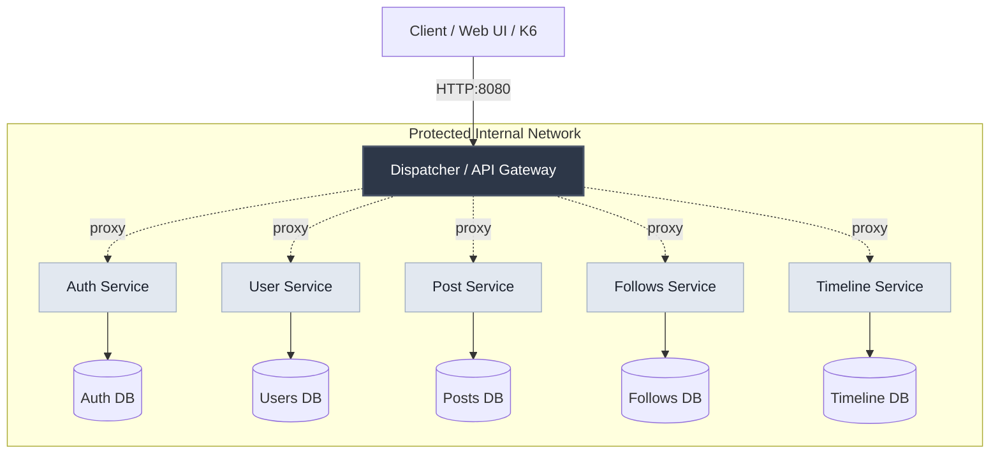

# PulseNet

PulseNet is a robust, scalable microservices-based social media platform backend. Designed to overcome the limitations of monolithic architectures, it demonstrates advanced system design principles including network isolation, database-per-service data management, and test-driven development (TDD). 

## Architecture

PulseNet utilizes a centralized **API Gateway (Dispatcher)** to handle all incoming client requests, routing them securely to independent backend services. The backend services are completely isolated from the outside world and communicate over an internal Docker network.



### Microservices
- **API Gateway (Dispatcher)**: The single entry point for the system. Handles routing, JWT authentication verification, and request proxying.
- **Auth Service**: Manages user registration, login, and JWT token generation.
- **User Service**: Handles user profile operations and retrieval.
- **Post Service**: Manages the creation, storage, and retrieval of social media posts.
- **Follows Service**: Orchestrates the user following/follower dynamics.
- **Timeline Service**: Aggregates data to generate chronological user feeds.

## Core Principles

- **Network Isolation:** Internal services are completely hidden from public access. They strictly accept routed requests through the API Gateway, verified by internal network configurations.
- **Database-per-Service:** To ensure loose coupling, each microservice operates with its own completely isolated NoSQL (MongoDB) instance.
- **RESTful Design:** Strict adherence to the Richardson Maturity Model (RMM) Level 2. The API uses clear, resource-oriented endpoints and descriptive HTTP status codes.
- **Test-Driven Development (TDD):** Core architectural components like the API Gateway routing logic are built utilizing a strict Red-Green-Refactor TDD cycle.

## Tech Stack

- **Backend & Framework**: C#, .NET
- **Database**: MongoDB
- **Infrastructure**: Docker, Docker Compose
- **Monitoring & Observability**: Prometheus, Grafana
- **Testing**: xUnit (Unit Testing), K6 (Performance/Load Testing)

## Getting Started

### Prerequisites
- [Docker](https://www.docker.com/) and [Docker Compose](https://docs.docker.com/compose/) must be installed on your machine.

### Running the Project

The entire infrastructure is containerized and managed via Docker Compose.

1. Clone the repository to your local machine:
   ```bash
   git clone https://github.com/yourusername/pulsenet-microservice.git
   cd pulsenet-microservice
   ```

2. Start the services using Docker Compose:
   ```bash
   docker-compose up -d
   ```

3. The primary entry point (API Gateway) will be accessible at `http://localhost:8080`.

## Monitoring & Load Testing

- **Observability:** PulseNet integrates Prometheus and Grafana to visualize traffic routing, success rates, and API performance. Once the containers are running, you can access the Grafana Dashboard directly to monitor the API Gateway operations.
- **Resilience:** The routing and proxy mechanisms have been subjected to comprehensive load testing using **K6**, simulating concurrent users to validate system stability and architecture flow under stress.

## License
[MIT License](LICENSE)
